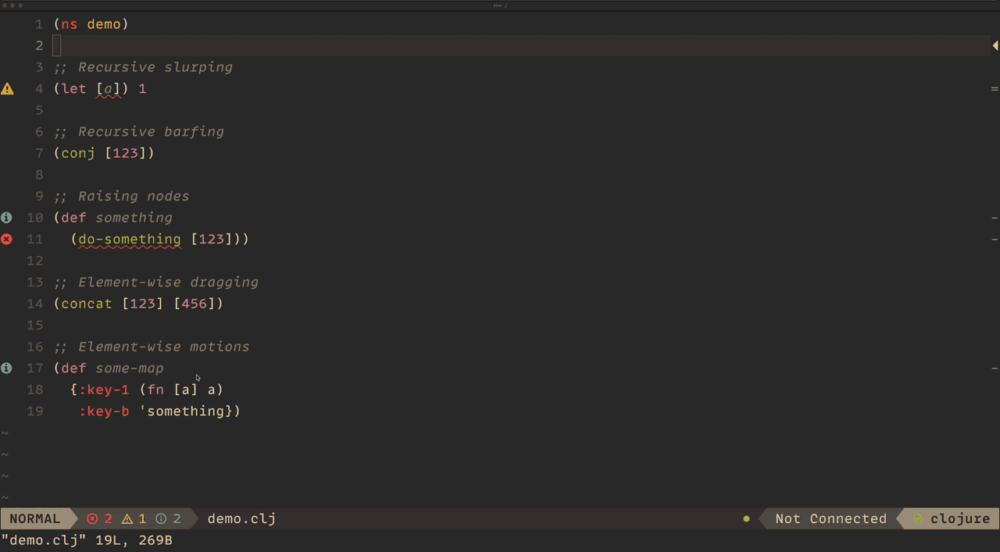

<div align="center">
  <h1>nvim-paredit</h1>
</div>

<div align="center">
  <p>
    
  </p>
  <p>
    A <a href="https://paredit.org/">Paredit</a> implementation for <a href="https://github.com/neovim/neovim/">Neovim</a>, built using <a href="https://github.com/tree-sitter/tree-sitter">Treesitter</a> and written in Lua.
  </p>
</div>

The goal of `nvim-paredit` is to provide a comparable s-expression editing experience in Neovim to that provided by
Emacs. This is what is provided:

- Treesitter based lisp structural editing, cursor motions and text object selections
- Dot-repeatable keybindings
- Language extensibility
- Programmable API

---



## Index

- **[Installation](#installation)**
- **[Configuration](#configuration)**
- **[API Reference](./docs/api-reference.md)**
- **[Recipes](./docs/recipes.md)**
- **[Auto Indentation](#auto-indentation)**
- **[Pairwise Dragging](#pairwise-dragging)**
- **[Language Support](#language-support)**
  - **[Language Extension Spec](./docs/language-extension-spec.md)**
  - **[Third-Party Language Extensions](#third-party-language-extensions)**
- **[Prior Art](#prior-art)**

## Installation

### Using [folke/lazy.vim](https://github.com/folke/lazy.nvim)

```lua
{
  "julienvincent/nvim-paredit",
  config = function()
    require("nvim-paredit").setup()
  end
}
```

## Configuration

```lua
local paredit = require("nvim-paredit")
paredit.setup({
  -- Change some keys
  keys = {
    ["<localleader>o"] = false,
    ["<localleader>r"] = { paredit.api.raise_form, "Raise form" },
  },
})
```

<details>
  <summary><code><b>Default Configuration Values</b></code></summary>

```lua
local paredit = require("nvim-paredit")
paredit.setup({
  -- should plugin use default keybindings? (default = true)
  use_default_keys = true,
  -- sometimes user wants to restrict plugin to certain file types only
  -- defaults to all supported file types including custom lang
  -- extensions (see next section)
  filetypes = { "clojure" },

  -- This controls where the cursor is placed when performing slurp/barf operations
  --
  -- - "remain" - It will never change the cursor position, keeping it in the same place
  -- - "follow" - It will always place the cursor on the form edge that was moved
  -- - "auto"   - A combination of remain and follow, it will try keep the cursor in the original position
  --              unless doing so would result in the cursor no longer being within the original form. In
  --              this case it will place the cursor on the moved edge
  cursor_behaviour = "auto", -- remain, follow, auto

  dragging = {
    -- If set to `true` paredit will attempt to infer if an element being
    -- dragged is part of a 'paired' form like as a map. If so then the element
    -- will be dragged along with it's pair.
    auto_drag_pairs = true,
  },

  indent = {
    -- This controls how nvim-paredit handles indentation when performing operations which
    -- should change the indentation of the form (such as when slurping or barfing).
    --
    -- When set to true then it will attempt to fix the indentation of nodes operated on.
    enabled = false,
    -- A function that will be called after a slurp/barf if you want to provide a custom indentation
    -- implementation.
    indentor = require("nvim-paredit.indentation.native").indentor,
  },

  -- list of default keybindings
  keys = {
    ["<localleader>@"] = { paredit.unwrap.unwrap_form_under_cursor, "Splice sexp" },
    [">)"] = { paredit.api.slurp_forwards, "Slurp forwards" },
    [">("] = { paredit.api.barf_backwards, "Barf backwards" },

    ["<)"] = { paredit.api.barf_forwards, "Barf forwards" },
    ["<("] = { paredit.api.slurp_backwards, "Slurp backwards" },

    [">e"] = { paredit.api.drag_element_forwards, "Drag element right" },
    ["<e"] = { paredit.api.drag_element_backwards, "Drag element left" },

    [">p"] = { api.drag_pair_forwards, "Drag element pairs right" },
    ["<p"] = { api.drag_pair_backwards, "Drag element pairs left" },

    [">f"] = { paredit.api.drag_form_forwards, "Drag form right" },
    ["<f"] = { paredit.api.drag_form_backwards, "Drag form left" },

    ["<localleader>o"] = { paredit.api.raise_form, "Raise form" },
    ["<localleader>O"] = { paredit.api.raise_element, "Raise element" },

    ["E"] = {
      paredit.api.move_to_next_element_tail,
      "Jump to next element tail",
      -- by default all keybindings are dot repeatable
      repeatable = false,
      mode = { "n", "x", "o", "v" },
    },
    ["W"] = {
      paredit.api.move_to_next_element_head,
      "Jump to next element head",
      repeatable = false,
      mode = { "n", "x", "o", "v" },
    },

    ["B"] = {
      paredit.api.move_to_prev_element_head,
      "Jump to previous element head",
      repeatable = false,
      mode = { "n", "x", "o", "v" },
    },
    ["gE"] = {
      paredit.api.move_to_prev_element_tail,
      "Jump to previous element tail",
      repeatable = false,
      mode = { "n", "x", "o", "v" },
    },

    ["("] = {
      paredit.api.move_to_parent_form_start,
      "Jump to parent form's head",
      repeatable = false,
      mode = { "n", "x", "v" },
    },
    [")"] = {
      paredit.api.move_to_parent_form_end,
      "Jump to parent form's tail",
      repeatable = false,
      mode = { "n", "x", "v" },
    },

    -- These are text object selection keybindings which can used with standard `d, y, c`, `v`
    ["af"] = {
      paredit.api.select_around_form,
      "Around form",
      repeatable = false,
      mode = { "o", "v" },
    },
    ["if"] = {
      paredit.api.select_in_form,
      "In form",
      repeatable = false,
      mode = { "o", "v" },
    },
    ["aF"] = {
      paredit.api.select_around_top_level_form,
      "Around top level form",
      repeatable = false,
      mode = { "o", "v" },
    },
    ["iF"] = {
      paredit.api.select_in_top_level_form,
      "In top level form",
      repeatable = false,
      mode = { "o", "v" },
    },
    ["ae"] = {
      paredit.api.select_element,
      "Around element",
      repeatable = false,
      mode = { "o", "v" },
    },
    ["ie"] = {
      paredit.api.select_element,
      "Element",
      repeatable = false,
      mode = { "o", "v" },
    },
  },
})
```

</details>

---

## API Reference

See **[api-reference.md](./docs/api-reference.md)**

## Auto Indentation

Nvim-paredit comes with built-in support for fixing form indentation when performing slurp and barf operations. By
default this behaviour is disabled and can be enabled by setting `indent.enabled = true` in the
[configuration](#configuration)

The main goal of this implementation is to provide a visual aid to the user, allowing them to confirm they are operating
on the correct node and to know when to stop when performing recursive slurp/barf operations. This implementation is
fast and does not result in any UI lag or jitter.

The goal is _not_ to be 100% correct. The implementation follows a simple set of rules which account for most scenarios
but not all. If a more correct implementation is needed then the native implementation can be replaced by setting the
configuration property `intent.indentor`.

For example an implementation using `vim.lsp.buf.format` could be built if you don't mind sacrificing performance for
correctness. See the **[lsp indentation recipe](./docs/recipes.md#lsp-indentation)** for an example of this.

## Pairwise Dragging

Nvim-paredit has support for dragging elements pairwise. If an element being dragged is within a form that contains
pairs of elements (such as a clojure `map`) then the element will be dragged along with it's pair.

For example:

```clojure
{:a 1
 |:b 2}
;; Drag backwards
{|:b 2
 :a 1}
```

This is enabled by default and can be disabled by setting `dragging.auto_drag_pairs = false` in the
[configuration](#configuration).

Pairwise dragging works using treesitter queries to identify element pairs within some localized node. This means you
can very easily extend the paredit pairwise implementation by simply adding new treesitter queries to your nvim
configuration.

You might want to extend if:

1. You are a language extension author and want to add pairwise dragging support to your extension.
2. You want to add support for some syntax not supported by nvim-paredit.

This is especially useful if you have your own clojure macros that you want to enable pairwise dragging on.

All you need to do to extend is to add a new file called `queries/<language>/paredit/pairwise.scm` in your nvim config
directory. Make sure to include the `;; extends` directive to the file or you will overwrite any pre-existing queries
defined by nvim-paredit or other language extensions.

As an example if you want to add support for the following clojure macro:

```clojure
(defmacro my-custom-bindings [bindings & body]
  ...)

(my-custom-bindings [a 1
                     b 2]
                    (println a b))
```

You can add the following TS query

```scm
;; extends

(list_lit
  (sym_lit) @fn-name
  (vec_lit
    (_) @pair)
  (#eq? @fn-name "my-custom-bindings"))
```

## Language Support

As this is built using Treesitter it requires that you have the relevant Treesitter grammar installed for your language
of choice. Additionally `nvim-paredit` will need explicit support for the treesitter grammar used by your language as
the node names and metadata of nodes vary between languages.

Right now `nvim-paredit` only has built in support for `clojure` but exposes an extension API for adding support for
other lisp dialects. See **[third-party language extensions](#third-party-language-extensions)** for some existing
support for other languages.

If you are an extension author and would like to add support for a lisp dialect take a look at the
[Language Extension Spec](./docs/language-extension-spec.md) for an overview on how to achieve this.

### Third-Party Language Extensions

- **[fennel](https://github.com/julienvincent/nvim-paredit-fennel)**
- **[scheme](https://github.com/ekaitz-zarraga/nvim-paredit-scheme)**

## Prior Art

#### [vim-sexp](https://github.com/guns/vim-sexp)

Currently the de-facto s-expression editing plugin with the most extensive set of available editing operations. If you
are looking for a more complete plugin with a wider range of supported languages then you might want to look into using
this instead.

The main reasons you might want to consider `nvim-paredit` instead are:

- Easier configuration and an exposed lua API
- Control over how the cursor is moved during slurp/barf. (For example if you don't want the cursor to always be moved)
- Recursive slurp/barf operations. If your cursor is in a nested form you can still slurp from the forms parent(s)
- Automatic form/element indentations on slurp/barf
- Subjectively better out-of-the-box keybindings

#### [vim-sexp-mappings-for-regular-people](https://github.com/tpope/vim-sexp-mappings-for-regular-people)

A companion to `vim-sexp` which configures `vim-sexp` with better mappings. The default mappings for `nvim-paredit` were
derived from here.
